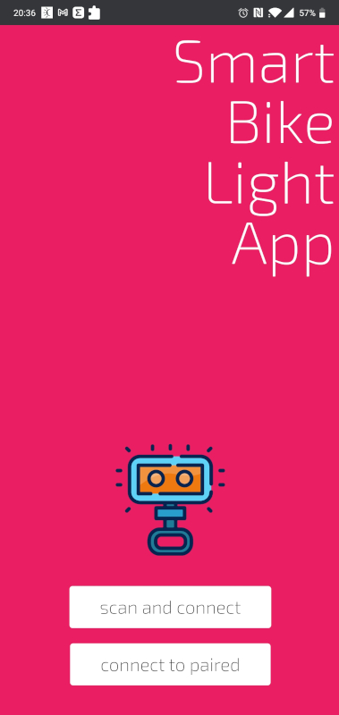
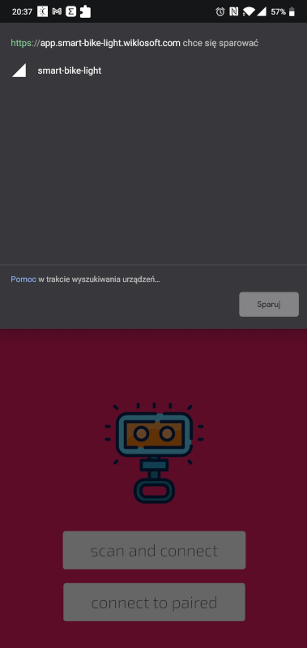
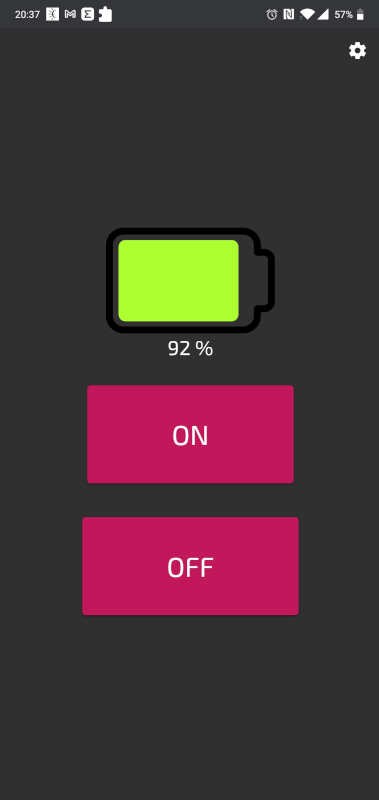
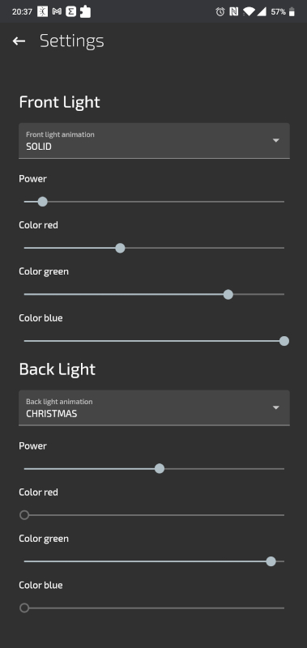

# Smart Bike Light

This respository contains companion app for Smart Bike Light (https://github.com/pwiklowski/smart-bike-light). Application is a PWA Angular application that uses Web Bluetooth API to control esp32 based device using BLE. It allows to turn light on/off, check battery level and set light settings.

For more informations about Web Bluetooth API go to: https://github.com/WebBluetoothCG/web-bluetooth

## Screens







## Development server

Run `ng serve` for a dev server. Navigate to `http://localhost:4200/`. The app will automatically reload if you change any of the source files.

## Build

Run `ng build` to build the project. The build artifacts will be stored in the `dist/` directory. Use the `--prod` flag for a production build.

## Deploy

Run

```bash
ng build --prod=true
docker-compose up -d --build
```

## Credits

<div>Icons made by <a href="" title="mangsaabguru">mangsaabguru</a> from <a href="https://www.flaticon.com/" title="Flaticon">www.flaticon.com</a></div>
